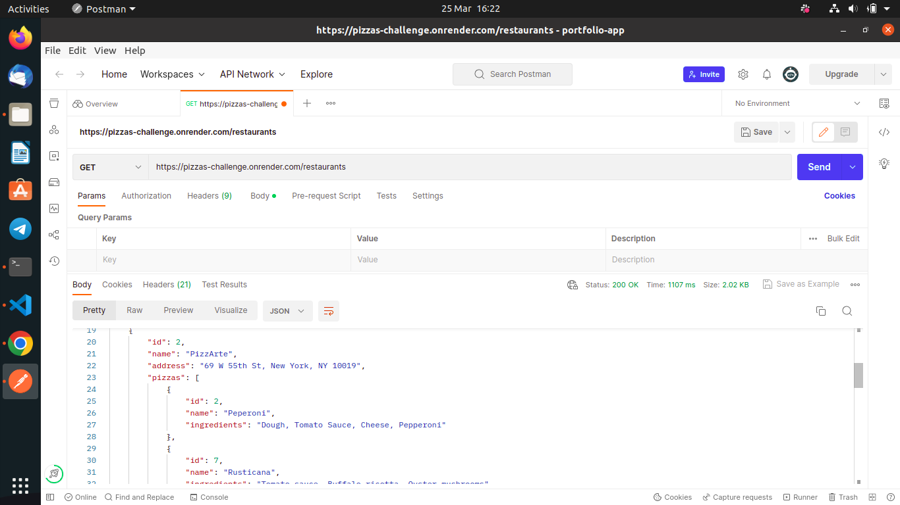

# Pizzas-Challenge
A mini Rails application that implements associations.
## Description
This is a simple Rails application that I developed to sharpen my skills on developing Rails applications, Active Record Associations and API development.

This is an API for tracking pizzas restaurants. I am working with three models: `Restaurant`, `Pizza` and `RestaurantPizza`. Their relationships are as follows:

- A `Restaurant` has many `Pizza`s through `RestaurantPizza`
- A `Pizza` has many `Restaurant`s through `RestaurantPizza`
- A `RestaurantPizza` belongs to a `Restaurant` and belongs to a `Pizza`

The ER Diagram below illustrates the above relationships:

## Getting Started
### Setup Requirements
- Operating System: Any UNIX based Operating System should suffice.
- Ruby installed on your system(version 2.7.3 and above).
- Rails (version 7 and above)
- Code editor/IDE to view and/or contribute to the project(preferably VScode or RubyMine IDE).
- Git installed on your system.

### Setup
To clone this repository in your PC, run:

        git clone git@github.com:Samueelx/pizzas-challenge.git

`cd` into the project directory and run this command to download the necessary gems/dependencies:

        bundle install

## Running the program
### Migrate the database
For this application to run, you first need to set up the database schema. To do so, you need to run a migration. Use this command to run the migration(at the root of the project direcory):

        rails db:migrate

Then, populate the database tables with sample data using the following command (at the root of the project direcory):

        rails db:seed

### Running the server
To run the server, execute the command below in your terminal:

        rails s

As the server is running, you can test out the endpoints from [postman](https://www.postman.com/)

The following endpoints are accessible:
- `GET /restaurants`
- `GET /restaurants/:id`
- `DELETE /restaurants/:id`
- `GET /pizzas`
- `POST /restaurant_pizzas`

---
## Alternatively
Alternatively, you can access the above endpoints without the need to clone the repository/application in your local computer by pasting [the url in the `about` section of this repo](https://pizzas-challenge.onrender.com) in the postman's address bar and appending the routes mentioned above.

Like the following screenshot:

## Authors
[Samuel Gitimu](https://github.com/Samueelx)

## License
This project is under the MIT license.